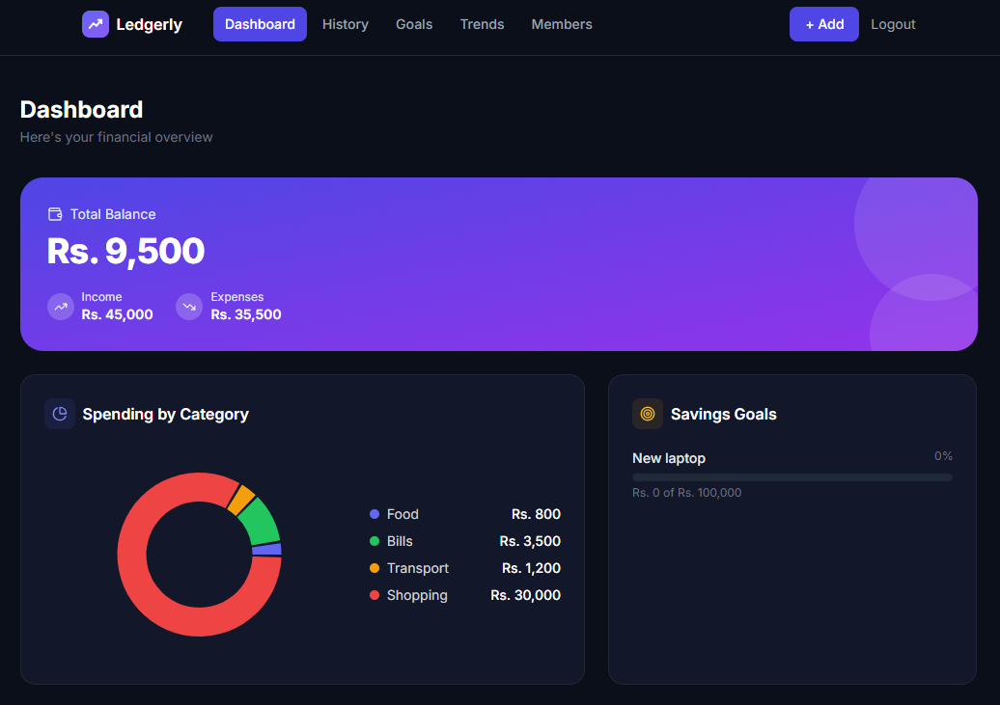
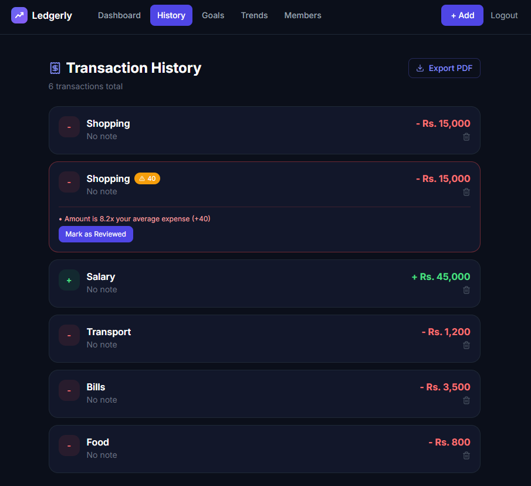
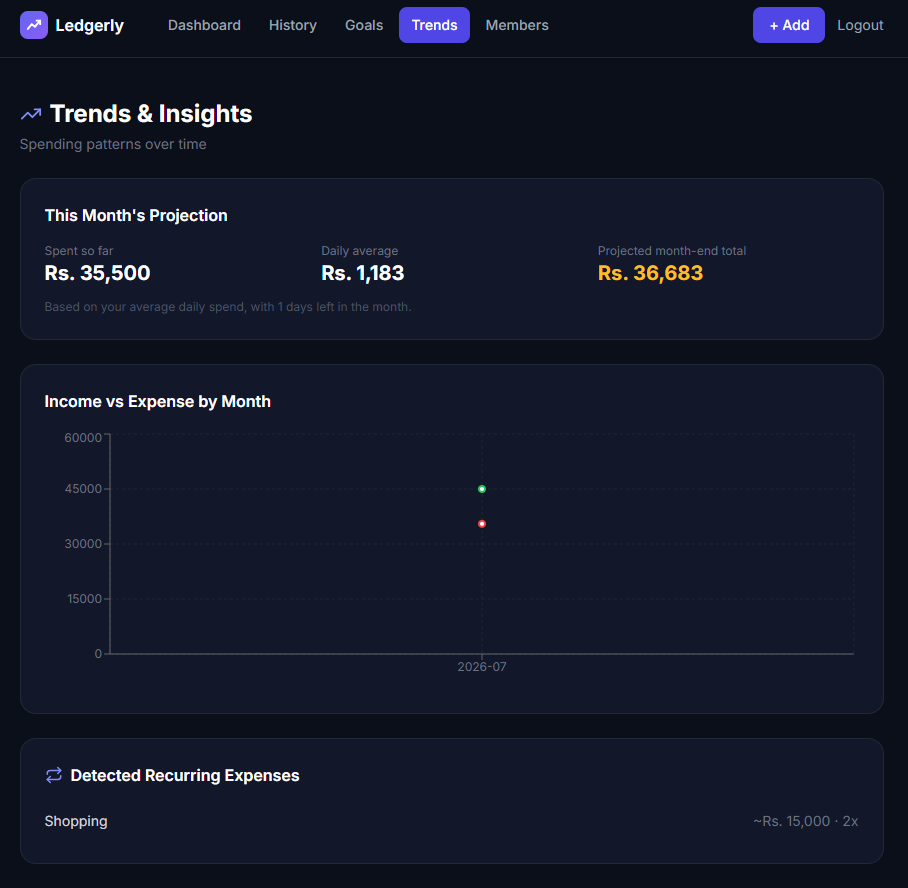
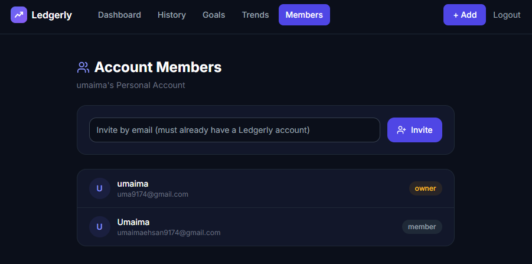

# Ledgerly

A full-stack personal finance tracker with JWT authentication, a custom rule-based fraud/anomaly detection engine, multi-user shared accounts, and spending trend analysis.



## Overview

Ledgerly lets users track income and expenses, set savings goals, and get automatic alerts when a transaction looks unusual — with a transparent, explainable risk score instead of a black-box flag.

## Key Features

**Authentication & Security**
- JWT-based authentication with bcrypt password hashing
- Enforced password strength (uppercase, lowercase, number, special character)
- Protected API routes via auth middleware

**Fraud / Anomaly Detection**
- Custom rule-based risk-scoring engine (0–100 score)
- Flags transactions that are unusually large compared to personal spending average
- Detects rapid transaction velocity (potential bot/fraud pattern)
- Detects first-time transactions in new categories
- Flags transactions made during unusual hours
- Every flag includes a plain-language reason — fully explainable, not a black box
- Review workflow to mark flagged transactions as checked

**Multi-User Shared Accounts**
- Users can invite others into a shared account (like a joint bank account)
- Role-based access (owner / member)

**Analytics & Insights**
- Live dashboard: balance, income, expenses, spending by category (pie chart)
- Monthly income vs. expense trend chart
- Spending projections based on daily average
- Automatic recurring-expense detection
- PDF statement export

**Savings Goals**
- Create goals with target amounts and deadlines
- Visual progress tracking

## Tech Stack

**Frontend:** React, Tailwind CSS, Recharts, Axios, jsPDF, Lucide React
**Backend:** Node.js, Express, MongoDB, Mongoose
**Auth:** JWT (jsonwebtoken), bcrypt

## Screenshots

### Dashboard


### Transaction History with Risk Flagging


### Trends & Predictions


### Shared Account Members


## How the Risk Engine Works

Each expense transaction is scored against four rules:

| Rule | Points | Trigger |
|---|---|---|
| Unusual amount | up to 40 | Amount is 3x+ the user's average expense |
| Rapid velocity | up to 30 | 3+ transactions within 60 seconds |
| New category | 15 | First-ever transaction in that category (after 5+ transaction history) |
| Unusual hour | 15 | Transaction made between 12am–5am |

Scores are capped at 100. Transactions scoring 40+ are flagged for review, with the specific triggered reasons shown to the user.

## Project Structure
ledgerly/
├── backend/ Express API, MongoDB models, auth middleware, risk engine
└── frontend/ React app — dashboard, history, goals, trends, members
## Running Locally

### Backend
```bash
cd backend
npm install
```
Create a `.env` file inside `backend/`:

MONGO_URI=your_mongodb_connection_string
JWT_SECRET=your_secret_key
PORT=5000

```bash
node index.js
```

### Frontend
```bash
cd frontend
npm install
npm start
```
Update `frontend/src/api/axios.js` if your backend runs on a different port/URL.

## API Endpoints

| Method | Endpoint | Description |
|---|---|---|
| POST | /api/auth/signup | Create account |
| POST | /api/auth/login | Login, returns JWT |
| GET | /api/transactions | Get all transactions |
| POST | /api/transactions | Add transaction (runs risk engine) |
| PATCH | /api/transactions/:id/review | Mark flagged transaction reviewed |
| DELETE | /api/transactions/:id | Delete transaction |
| GET | /api/goals | Get savings goals |
| POST | /api/goals | Create goal |
| GET | /api/dashboard/summary | Balance, spending breakdown, goals |
| GET | /api/dashboard/trends | Monthly trends, predictions, recurring expenses |
| POST | /api/accounts/invite | Invite a user to shared account |
| GET | /api/accounts/members | List account members |

## What I Learned

Building Ledgerly meant working across the full stack — schema design, authentication, API design, a custom detection algorithm, and UI — and debugging real issues that don't show up in tutorials: DNS/network failures, stale sessions after a schema migration, duplicate routes, and reworking the data model when requirements changed (moving from single-user to shared multi-user accounts).
